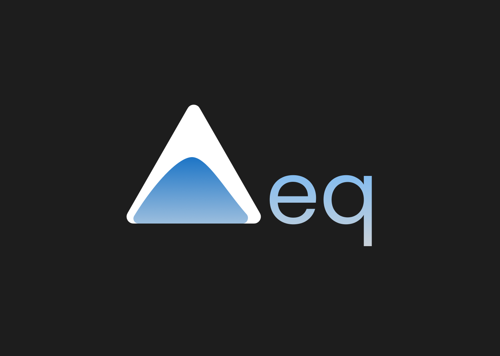

# Ternary Equilibrium

`Ternary Equilibrium` is an **easy-to-use** and **easy-to-access** resource to create ternary graphs for scientists. It is made for people that want a convenient way to create presentation ready graphs.

Read through the whole [Blogpost](https://fabiwo.io/blog/ternary-equilibrium) for further explanation.

### Contents

  - [Run Locally](#run-locally)
  - [Production Build](#production-build)
  - [Citation](#citation)
  - [License](#license)
  - [Contact](#contact)
### Run Locally

Clone the project

```bash
  git clone https://github.com/fabiwo/ternary-equilibrium.git ternary-equilibrium
```
go to the project directory

```bash
  cd ternary-equilibrium
```

Install dependencies

```bash
  npm install
```

Start the development server

```bash
  npm run dev
```

### Production Build
The project uses [Vite](https://vitejs.dev/) to bundle everything.

```bash
  npm run build
```
creates the final bundle inside the `dist` directory. Just serve the `index.html` file inside it. 

You can start a local server for the production build by running

```bash
  npm run serve
```
### Citation

F. Wolff, Ternary Equilibrium, (2021), GitHub repository, https://github.com/fabiwo/ternary-equilibrium
### License
Distributed under the GNU GPLv3 License. See [License](LICENSE) for more information.

### Contact
Fabian Wolff - fabiandwolff@gmail.com
